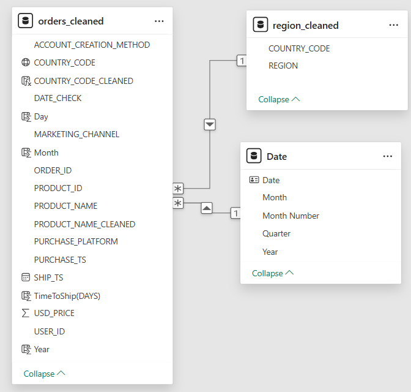
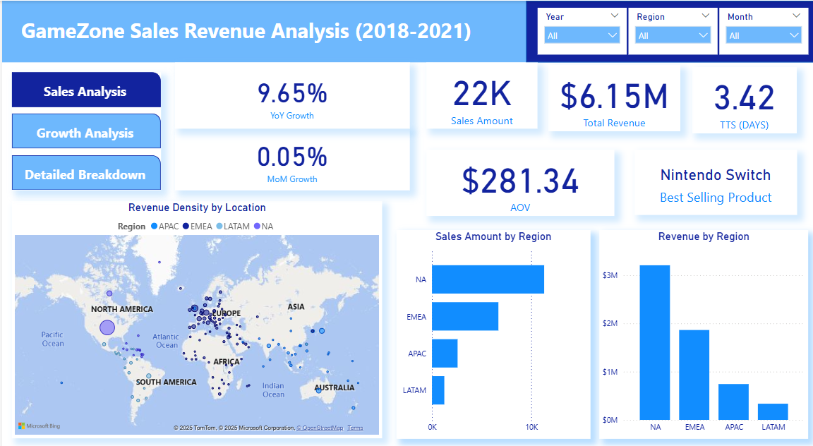
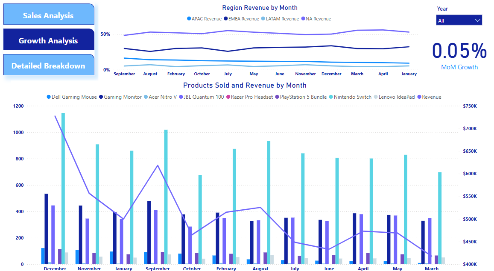
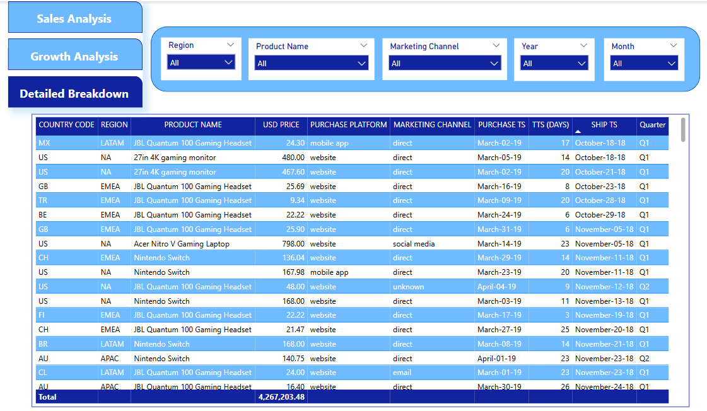

# GameZone Sales Analytics Project

**Tools:** Power BI · Power Query · DAX · Excel  
**Domain:** E-Commerce · Sales Analysis · Regional Trends · Product Strategy  
**Duration:** 2018–2021 | **Records Analyzed:** 22,000+ Orders

---

## Project Overview

This project analyzes historical sales data from a fictional company called *GameZone*, a global retailer of gaming electronics and accessories. The goal was to extract actionable insights on sales performance, customer trends, regional growth, and product performance using interactive dashboards and data modeling.

The analysis supports business decisions in marketing, inventory, and regional strategy, powered by Power BI and advanced DAX calculations.

---

## Data Cleaning and Modeling

**Source:** Cleaned order data, region dimension, and date table  
**Key Transformations (Power Query):**
- Standardized date formats and time zones
- Cleaned product and region naming inconsistencies
- Calculated shipping time (`TimeToShip(DAYS)`)
- Mapped country codes to standardized regions

**Data Model Design:**
- `orders_cleaned` (fact table)
- `region_cleaned` (region dimension)
- `Date` (date dimension)
- Star schema with relationships on `COUNTRY_CODE` and `PURCHASE_TS`

### 🔗 Data Model Diagram

  
*This visual illustrates the data relationships between `orders_cleaned`, `region_cleaned`, and the `Date` table.*

---

## Executive Summary

- **Total Revenue:** $6.15M  
- **Total Orders:** 22K  
- **Year-over-Year (YoY) Growth:** +9.65%  
- **Month-over-Month (MoM) Growth:** +0.05%  
- **Average Time to Ship:** 3.42 Days  
- **Average Order Value (AOV):** $281.34  
- **Best-Selling Product:** Nintendo Switch  
- **Top Region by Revenue:** North America (~$3M+)

---

## Dashboard Highlights

### 📊 Main Sales Dashboard

  
*Shows overall KPIs including YoY growth, revenue, sales amount, AOV, and top product by sales.*

### 📈 Growth Metrics Dashboard

  
*Tracks month-over-month and year-over-year performance metrics.*

### 🧾 Detailed Breakdown Matrix

  
*Allows stakeholders to apply filters (region, product, time, platform) and view detailed metrics in a matrix format.*

---

## Key Insights

### 1. Sales Trends & Seasonality
- Sales peak between **September and March**, aligning with back-to-school and holiday periods.
- February and July show consistently lower performance.
- Month-over-month growth is flat, indicating seasonal or market saturation effects.

### 2. Regional Performance
- **North America** leads with over **50% of revenue** and a strong repeat-customer base.
- **EMEA** is second in performance (~$2M).
- **APAC** and **LATAM** remain underpenetrated but showed promising spikes.

### 3. Product Performance
- The **Nintendo Switch** is the top-selling product across all years.
- Mainstream gaming consoles outperform premium accessories in unit volume.
- Opportunity exists in bundling low-value items like cables to increase AOV.

---

## Recommendations

### Maximize Seasonal Sales Windows
- Prioritize marketing and logistics from **September–March**.
- Launch bundled promotions during peak retail periods (e.g., Black Friday, holidays).

### Expand High-Performing Product Lines
- Continue featuring the Nintendo Switch and related bundles.
- Explore more SKUs within monitors and gaming headsets.

### Invest in Regional Growth
- Focus campaigns and inventory on **North America** and **EMEA**.
- Build regional promotions to capture **APAC** and **LATAM** growth potential.

### Improve Channel Visibility
- Integrate deeper analysis into `MARKETING_CHANNEL` and `PURCHASE_PLATFORM`.
- Identify underutilized channels with high average order value.

### Optimize Fulfillment Strategy
- Reduce average time to ship (below 3.42 days) to improve customer experience and loyalty.

---

## Next Steps

- Add customer segmentation and retention metrics
- Integrate loyalty program data for lifetime value (LTV) modeling
- Add refund and return rate analysis
- Consider predictive modeling for demand forecasting

---

## How to Use This Repo

To view the dashboards or edit the data model:

1. Open `GameZone.pbix` in Power BI Desktop  
2. Use the filter panel to interact with time, region, platform, and product views  
3. DAX measures are present in `GameZone.pbix`
4. Dataset: located in `gamezone-orders-data.xlsx`. Credits to Christine Jiang for the data

---

## Contact

**Author:** Mirza Baig  
📧 [Email](mirza.shujath1889@gmail.com)
🔗 [LinkedIn](http://www.linkedin.com/in/mirza-baig-mmirzash1889)

